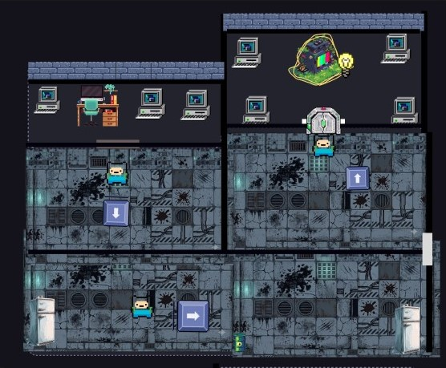
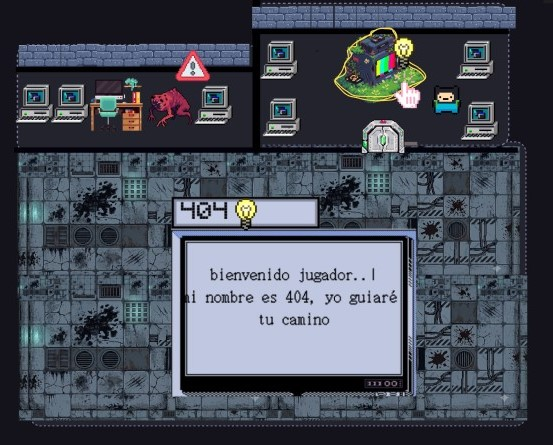
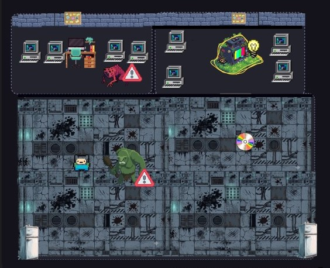
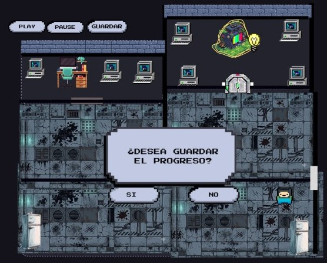

# Mockup - Explorar Laboratorio  
**Proyecto:** 404: SURVIVAL  
**Equipo:** Human Not Found  
**Fecha:** 04/08/2026  

---

## Representación del mapa (Tile-map 2D)

El escenario está representado mediante un **tile-map en 2D** con vista superior (top-down).  
El jugador puede moverse libremente en **cuatro direcciones**: arriba, abajo, izquierda y derecha.

> *El jugador explora el laboratorio, abre puertas y accede a nuevas zonas.*

---

## Interacción con puertas y ayuda de la IA

El personaje puede **abrir puertas** para avanzar entre áreas.  
La **IA 404** detecta cuando el jugador necesita orientación y proporciona **instrucciones contextuales** para guiarlo.

> *La IA aparece cuando el jugador parece perdido o requiere ayuda.*

---

## Identificación y evasión de amenazas

Durante la exploración, pueden aparecer **amenazas** (enemigos, trampas, peligros ambientales).  
El jugador tiene la opción de:

- **Esquivar** la amenaza.
- Buscar una **ruta alternativa** para continuar.

> *El sistema alerta al jugador sobre peligros cercanos.*

---

## Guardado de progreso

El jugador puede guardar su progreso en cualquier momento mediante un **menú desplegable o botón de guardado**.  
Esto permite continuar la partida más tarde sin perder avances.

> *Menú de guardado accesible desde la interfaz principal.*

---

## Diseño completo en Figma

Puedes visualizar prototipo completo en el siguiente enlace:

[Mockup en Figma - Explorar Laboratorio](https://www.figma.com/design/5hT5YUaTXLZCqfSCVeTTt4/MOCKUP-CASO-DE-USO-EXPLORAR-LABORATORIO?node-id=0-1&p=f&t=5hU8bGCAnLwlOyP2-0)
